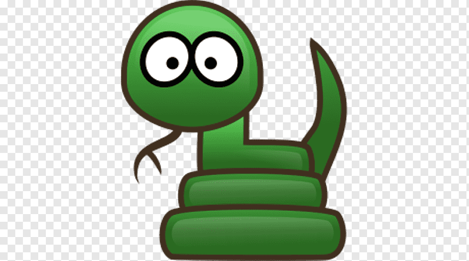
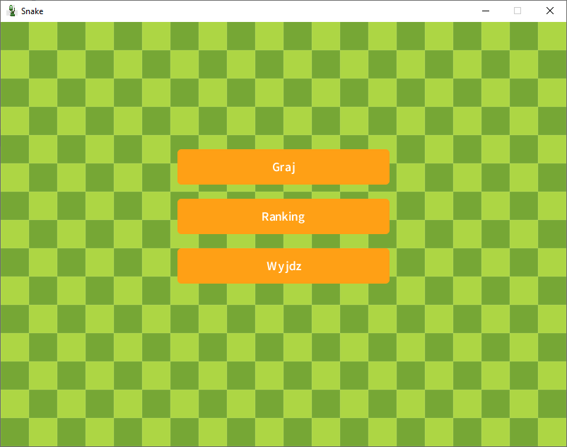
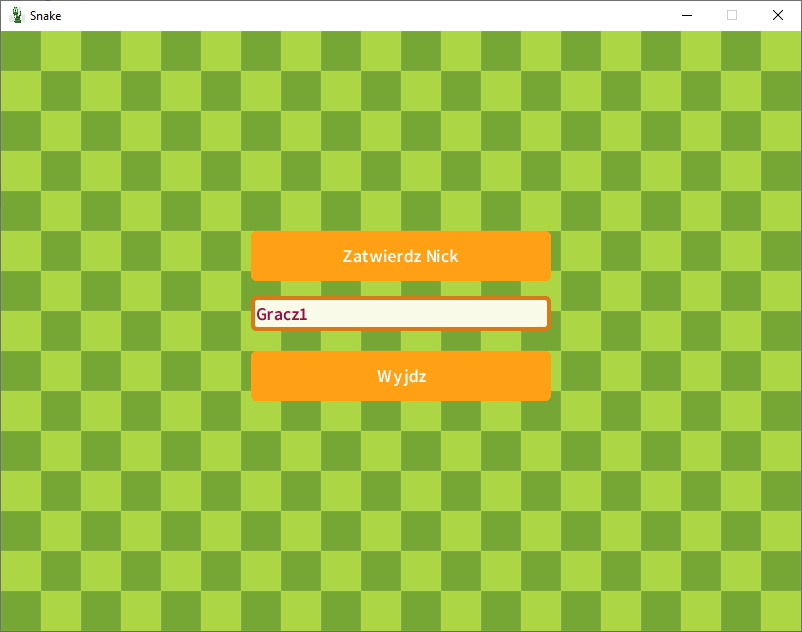
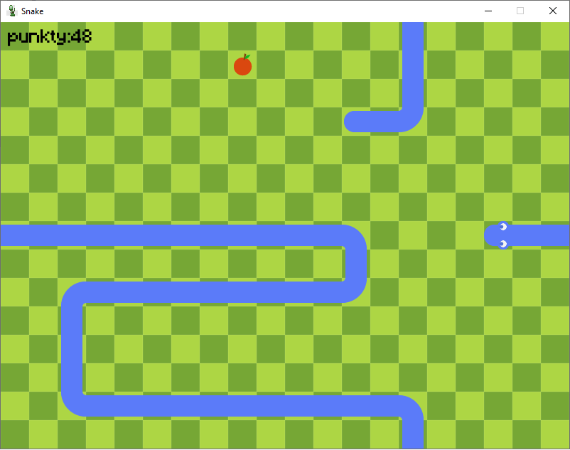
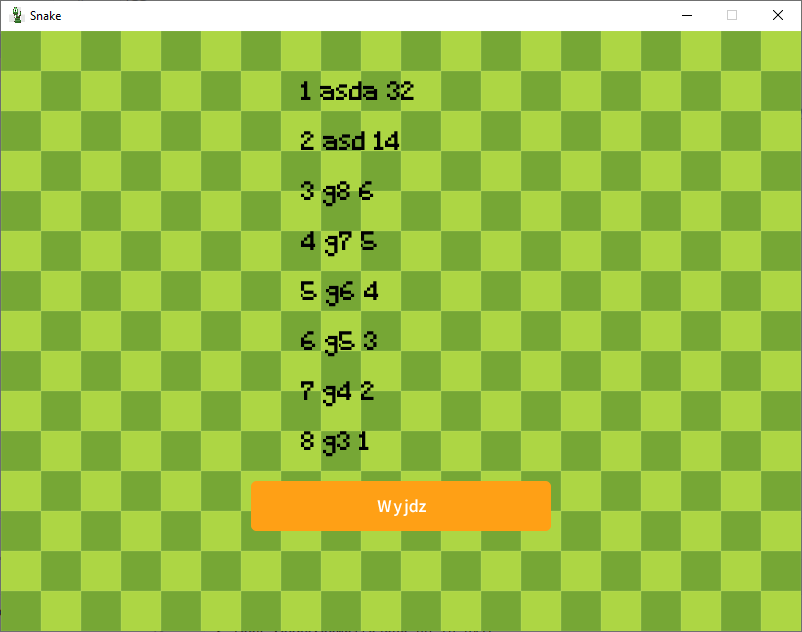

# SnakeGameJavaLibGDX

SnakeGameJavaLibGDX to prosta implementacja klasycznej gry Snake napisana w języku Java z użyciem biblioteki libGDX.

## Instrukcja

### Uruchomienie gry

1. Sklonuj repozytorium na swoje urządzenie.
2. Otwórz projekt w środowisku programistycznym obsługującym język Java, takim jak IntelliJ IDEA lub Eclipse.
3. Upewnij się, że masz skonfigurowane środowisko do pracy z libGDX.
4. Uruchom grę z poziomu klasy `DesktopLauncher.java`.

### Zasady gry

1. Sterujesz wężem za pomocą strzałek kierunkowych.
2. Celem gry jest zebrać jak najwięcej punktów poprzez zjadanie jedzenia (symbolizowane przez owalne elementy).
3. Unikaj zderzeń z własnym ogonem. Zderzenie zakończy grę.

### Punkty

- Zdobywasz punkty za każde zjedzenie jedzenia. Im dłużej przeżyjesz, tym więcej punktów zdobędziesz.

## Zrzuty ekranu

